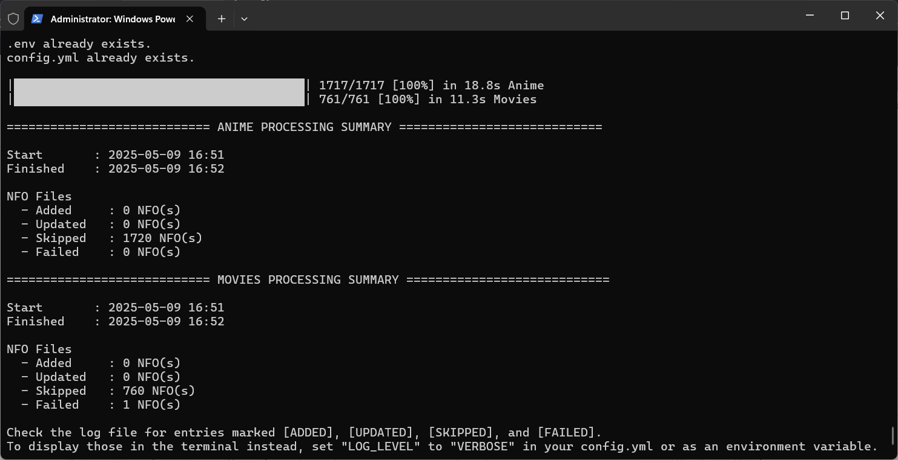
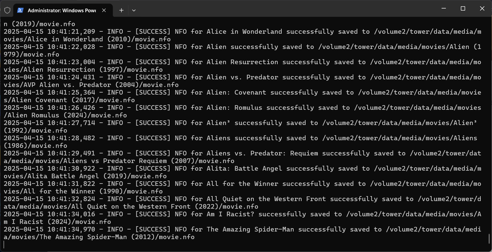

# Plex NFO Exporter

**Plex NFO Exporter** pulls metadata, posters, and background art out of Plex and writes them as `.nfo` and image files alongside your media, in a format other media servers like Jellyfin can read directly.

> **This project was previously developed manually and is now AI-assisted.** Development has shifted to working alongside AI coding assistants, which contribute code, tests, and documentation alongside the maintainer. Review changes accordingly if that matters for your use case.

By default, the terminal only shows a summary; full detail goes to the log file:


<details>
   <summary>Verbose, shows detailed processes:</summary>

   

</details>

---

## Features

- Exports Plex media metadata into `.nfo` files, matching Plex's current movie/TV agents as well as the [Hama agent](https://github.com/ZeroQI/Hama.bundle).
- Multiple naming formats for exports, e.g. poster as `poster.jpg` or `{filename}_poster.jpg`.
- Writes files straight into the media directory, so other media servers can pick them up immediately.
- **Never refreshes or modifies Plex's own library metadata**, read-only against Plex.
- Choose exactly which metadata fields to export (title, tagline, plot, year, etc.), and which libraries to process, or export everything.
- Supports path mapping when Plex and the exporter see different filesystem layouts.
- Works with **movies**, **TV shows**, and **music** libraries, including multiple movie titles living in the same directory.

---

## How to Use

### Using Docker (Recommended)

Run the Plex NFO Exporter using the official Docker image:
```bash
docker run --rm \
  -v /path/to/config:/app/config \
  -v /path/to/config/logs:/app/logs \
  -v /path/to/media:/media \
  -e TZ=Asia/Jakarta \
  -e CRON_SCHEDULE=0 4 * * * \
  -e RUN_IMMEDIATELY=false \
  -e PLEX_URL='http://plex_ip:port' \
  -e PLEX_TOKEN='super-secret-token' \
  -e DRY_RUN=false \
  -e FORCE_OVERWRITE=false \
  -e LOG_LEVEL=INFO \
  ghcr.io/van-geaux/plex_nfo_exporter:latest
```

#### Docker Compose Example

```yaml
services:
  plex-nfo-exporter:
    image: ghcr.io/van-geaux/plex_nfo_exporter:latest
    user: 1000:100 # set this to match your media folder’s user and group ID. If left out, all files will be created as root
    environment:
      - TZ=Asia/Jakarta
      - CRON_SCHEDULE=0 4 * * * # if not set will default to 4AM everyday
      - RUN_IMMEDIATELY=false  # if true will run immediately at start regardless of cron
      - PLEX_URL='http://plex_ip:port' # optional, you need to set in config.yml otherwise
      - PLEX_TOKEN='super-secret-token' # optional, you need to set in config.yml otherwise
      - DRY_RUN=false # optional, will simulate actions without writing any files
      - FORCE_OVERWRITE=false # optional, force overwrite files without checking server metadata; overrides config.yml setting
      - LOG_LEVEL=VERBOSE # optional, if not set default to `INFO`, use `VERBOSE` to print detailed processing instead of only summary
    volumes:
      - /path/to/config:/app/config
      - /path/to/config/logs:/app/logs # optional, you need to create the logs folder if you want to mount it
      - /volume1/data/media:/data_media # left side local path, right side plex path. YOU NEED TO SET THIS EVEN IF BOTH ARE THE SAME
```

After the first deployment, fill in the generated `config.yml` and `.env` before restarting the container. The `.env` file is only generated if you aren't already supplying `PLEX_URL`/`PLEX_TOKEN` as environment variables:
```yaml
PLEX_URL='http://plex_ip:plex_port' # i.e. http://192.168.1.2:32400 or https://plex.yourdomain.tld if using proxy
PLEX_TOKEN='super-secret-token'
```

### Path Mapping

`Path mapping` in `config.yml` tells the exporter how to translate a file path as *Plex* reports it into the path as *this container* sees it. **Every Plex library root needs an entry once you have any entries at all** — including a root that's mounted at the exact same path for both Plex and this container. For example, if you mount the same host folder at `/synology` in both Plex and this container, you still need:
```yaml
Path mapping: [
    {
        'plex': '/synology',
        'local': '/synology'
    }
]
```

This is deliberate: once `Path mapping` isn't empty, any reported path that doesn't match one of your entries is rejected rather than silently trusted, so an unexpected or unmapped path can never be treated as a safe location to write NFO/image files into. If you skip a root, exports for that library will fail with an error like:
```
Plex media path is outside configured mappings: '/synology/Some Show (2022)'
```
The fix is always the same — add the missing root to `Path mapping`, even if `plex` and `local` are identical.

The only time you can leave `Path mapping` completely empty (`Path mapping: []`) is when *every* Plex library root is mounted at the identical path in this container — in that case there's nothing to translate and no entries are required.

### Running Manually

1. **Download and prepare the script**
   Clone or download the repository, ensuring the following files are included:
   - `config.yml` (will create if not exists)
   - `.env` (will create if not exists)
   - `main.py`
   - `requirements.txt`

2. **Configure the script**
   Edit `config.yml` and `.env` to include your desired settings and credentials.

3. **Install Python**
   Install Python (tested with Python 3.9–3.11).

4. **Set up the environment**
   Open a terminal and navigate to the script directory:
   ```bash
   cd /your_directory/plex_nfo_exporter
   ```

   (Optional) Create and activate a virtual environment:
   ```bash
   python -m venv env
   env\Scripts\activate    # Windows
   source env/bin/activate # macOS/Linux
   ```

5. **Install dependencies**
   ```bash
   pip install -r requirements.txt
   ```

6. **Run the script**
   ```bash
   python main.py
   ```

### Command-Line Options

Command-line flags override the corresponding `config.yml` setting for that run. If a flag isn't provided, the script falls back to the config file value.

#### Connection Options

| Flag            | Description                                                 |
|-----------------|-------------------------------------------------------------|
| `--url`, `-u`   | Plex server base URL (e.g. `http://localhost:32400`)        |
| `--token`       | Plex token (required for authentication)                    |

#### Target Selection

| Flag              | Description                                                            |
|-------------------|------------------------------------------------------------------------|
| `--library`, `-l` | One or more library names to process (e.g. Movies, TV Shows). Wrap names containing spaces in quotes (e.g. `"TV Shows"`). |
| `--title`, `-t`   | One or more specific media titles to process. This doesn't perform a search — it scans every item in the library and processes it if the title matches one in the provided list. Wrap titles containing spaces in quotes (e.g. `"Some Movie"`). |

#### Export Settings

| Flag                | Description                                                   |
|---------------------|---------------------------------------------------------------|
| `--nfo-name-type`   | Naming style for NFO files: `default`, `title`, or `filename` |
| `--image-name-type` | Naming style for images: `default`, `title`, or `filename`    |
| `--force-overwrite`, `-f` | Overwrite files without checking server metadata; overrides `config.yml`. |

#### Export Toggles

Each export option has a pair of flags — one to enable, one to disable.

| Enable Flag                  | Disable Flag                 | Description                          |
|-----------------------------|------------------------------|--------------------------------------|
| `--export-nfo`              | `--no-export-nfo`            | Export NFO files                     |
| `--export-poster`           | `--no-export-poster`         | Export posters                       |
| `--export-fanart`           | `--no-export-fanart`         | Export fanart                        |
| `--export-season-poster`    | `--no-export-season-poster`  | Export season-level posters          |
| `--export-episode-nfo`      | `--no-export-episode-nfo`    | Export episode-level NFO files       |

#### Other Options

| Flag          | Description                                                                                         |
|---------------|-----------------------------------------------------------------------------------------------------|
| `--dry-run`   | Simulate actions without writing any files                                                          |
| `--log-level` | Logging level (`DEBUG`, `INFO`, `WARNING`, `ERROR`, `CRITICAL`, or `VERBOSE`). Defaults to `INFO`. Use `VERBOSE` to print detailed processing instead of only a summary. |

## Background

- **About me**
  I'm not a developer by trade, but I manage both Plex and Jellyfin to get the best of convenience and flexibility. My primary library is anime in Plex, using the Hama agent with romaji names.

- **Why this script?**
  I needed a way to keep Plex and Jellyfin libraries in sync, especially for anime with custom posters and art. Existing tools either required a full library refresh (e.g. Lambda) or worked in the opposite direction (e.g. XBMC Importer).

- **Kometa integration**
  I use [Kometa](https://kometa.wiki/) to beautify posters, which works perfectly alongside this script.

## Future Plans

- Enhance compatibility with more media servers.

## Contributions & Feedback

Feel free to open an issue or submit a pull request for improvements or feature requests.
